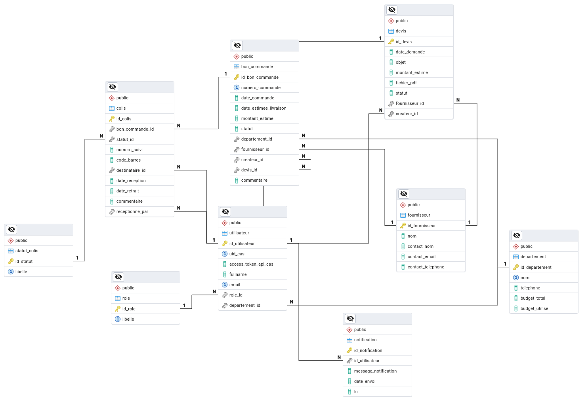

(Windows -> https://www.php.net/downloads.php?usage=web&os=windows&osvariant=linux-ubuntu&version=default)

Video for install PHP CLI Windows -> https://www.youtube.com/watch?v=n04w2SzGr_U

- To lance the project backend (PS : You need PHP CLI 8.3 minimum)
- Need Composer (Packages PHP manager)
- CAS utilise XM parser les réponses XML du serveur CAS

Use this command for Linux (distribution Ubuntu)
```
make linux
```

- For install dependances
```
make i
```

- For run
```
make r
```

(if the composer.json not found make this in Folder Backend/src)
```
composer init --name="sae/backend" --require="apereo/phpcas:^1.6" --no-interaction
```
